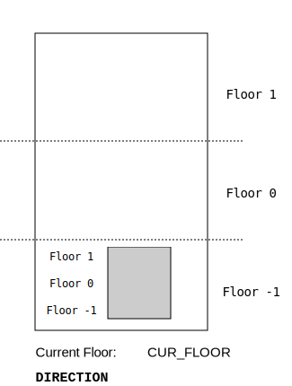

Sample - embed svg image.

Note: tested - rendered correctly by
- Markdown Viewer Chrome Plugin
- Markdown Preview Plus Chrome Plugin

NOT working with:
- gitlist embedded md renderer 
	- cannot resolve relative paths

